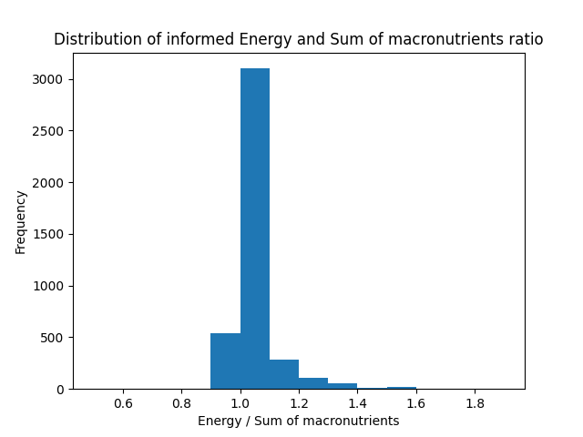

## ambiguities
1)
Food that has over 0.4g/100g of alcohol will be removed (including rum-tiramisu).

2)
If the amount of salt and sodium is not limited, the algorithm will suggest way too much salt and sodium. Hence, adding limitations to these too.

Will also add possibility to choose low and high salt/sodium diet depending if you have too high levels or if you do a lot of sports where you are sweating and hence, need more salt/sodium.

3)
The amount of energy (kcal or kJ) from a 1 gram of macronutrient is generally calculated as following: 
- 1g of carbs = 4 kcal (17 kJ)
- 1g of protein = 4 kcal (17 kJ)
- 1g of alcohol = 7 kcal (30 kJ) 
- 1g of fat = 9 kcal (38 kJ)
When calculating the energy sum of macronutrients of each food item in the [Fineli](https://fineli.fi/fineli/en/elintarvikkeet/resultset.csv) dataset, most of them are close to the the informer `energy,calculated (kJ)`. To be axact 96.8% of the informed energy was within -10% to +30% of the calculated energy sum of macronutrients. 

However, there are some products that are extreme outliers. This might be caused by some ingredients that are not listed in macronutrient but are added to the `energy,calculated (kJ)`. For example **fibre, xylitol and sorbitol** are not included in either sugar or carbs even though it clearly exists in the product energy calculated (kJ).

This makes sense to some level because fibre does not really contribute calories to the body, in a roundabout way ([source](https://www.ncbi.nlm.nih.gov/pubmed/30805214)).  On the other hand Sorbitol and Xylitol include calories, about 2.5 calories per gram, but that is significantly less than normal sugar which is about 4 calories per gram, but they don't seem to be calculated as sugar at all. See the problem cases under here:

Row |                           name  |energy,calculated (kJ) | fat, total (g) | carbohydrate, available (g) | protein, total (g) | fibre, total (g) | sugars, total (g) | alcohol (g)|
----|---------------------------------|-----------------------|----------------|-----------------------------|--------------------|------------------|-------------------|------------|
2369|Oat, Coarse-Ground Oat, Kaurakuitunen |             1075 |            3.3 |                        16.1 |                7.2 |             69.7 |               0.6 |           0|
2542|Pastille Sweetened With Xylitol  |                  1000 |            0.8 |                           0 |                0.5 |                0 |                 0 |           0|
3472|Sorbitol                         |                  1000 |              0 |                           0 |                  0 |                0 |                 0 |           0|

Most significant outliers

Row  |                                               name | energy,calculated (kJ) | fat, total (g) | carbohydrate, available (g) | protein, total (g) | fibre, total (g) | sugars, total (g) | alcohol (g) | energy / sum of macronutrients |
-----|----------------------------------------------------|------------------------|----------------|-----------------------------|--------------------|------------------|-------------------|-------------|-------------|
3074 |               Rowanberry, Dried, Rowanberry Powder |                   1103 |            6.9 |                         8.2 |                8.8 |             50.3 |               7.5 |           0 |  2.001089   |
2369 |              Oat, Coarse-Ground Oat, Kaurakuitunen |                   1075 |            3.3 |                        16.1 |                7.2 |             69.7 |               0.6 |           0 |  2.061361   |
3382 |                             Seaweed, Wakame, Dried |                    696 |            2.0 |                           0 |               14.4 |             47.1 |                 0 |           0 |  2.169576   |
941  |               Chokeberry, Dried, Chokeberry Powder |                   1013 |            2.4 |                        16.3 |                5.1 |             49.1 |              14.9 |           0 |  2.226374   |
2502 |                                            Parsley |                    114 |            0.2 |                         1.1 |                1.4 |              8.0 |               0.8 |           0 |  2.275449   |
3075 |                                 Rowanberry, Sorbus |                    313 |            1.2 |                         4.2 |                1.1 |              6.5 |               4.1 |           0 |  2.306559   |
972  |                             Coffee, Instant, Drink |                      4 |           <0.1 |                        <0.1 |                0.1 |                0 |                 0 |           0 |  2.352941   |
1736 |                                Lemon, Without Skin |                    138 |            0.2 |                         2.2 |                0.6 |              2.8 |               2.2 |           0 |  2.500000   |
1614 |                                Jerusalem Artichoke |                    218 |            0.1 |                         2.9 |                1.8 |             16.4 |               2.8 |           0 |  2.604540   |
1737 |                                   Lemon, With Skin |                     90 |            0.1 |                         1.4 |                0.4 |              1.8 |               1.4 |           0 |  2.616279   |
1739 |                Lemon Juice, Unsweetened, Undiluted |                     91 |              0 |                         1.6 |                0.3 |              0.1 |               1.6 |           0 |  2.817337   |
2543 |   Pastille Sweetened With Xylitol, Added Vitamin C |                    974 |            0.8 |                         8.0 |                1.1 |                0 |               8.0 |           0 |  5.262021   |
3939 |                              Vinegar, Wine Vinegar |                     86 |              0 |                         0.5 |                  0 |                0 |               0.5 |           0 | 10.117647   |
2791 |                                     Psyllium Husks |                    728 |            0.6 |                           0 |                1.5 |             85.0 |                 0 |           0 | 15.072464   |
3938 |                                            Vinegar |                    138 |              0 |                         0.5 |                  0 |                0 |               0.5 |           0 | 16.235294   |
1406 |                             Full- Xylitol Pastille |                    937 |            0.8 |                           0 |                0.5 |                0 |                 0 |           0 | 24.087404   |
2542 |                    Pastille Sweetened With Xylitol |                   1000 |            0.8 |                           0 |                0.5 |                0 |                 0 |           0 | 25.706941   |
3300 |              Salty Liqourice Pastille, Unsweetened |                    799 |            0.2 |                           0 |                0.1 |              NaN |                 0 |           0 | 85.913978   |
1275 |  Fitness Drink With Added Vitamins, Artificiall... |                      4 |              0 |                           0 |                  0 |              0.5 |                 0 |           0 | inf         |
3662 |                           Sweet, Candy, Sugar-Free |                    812 |              0 |                           0 |                  0 |             34.0 |                 0 |           0 | inf         |
3733 |                                                Tea |                      1 |              0 |                           0 |                0.1 |                0 |                 0 |           0 | inf         |
3734 |                                     Tea, Green Tea |                      1 |              0 |                           0 |                0.1 |                0 |                 0 |           0 | inf         |
3472 |                                           Sorbitol |                   1000 |              0 |                           0 |                  0 |                0 |                 0 |           0 | inf         |
782  |                     Chewing Gum, Xylitol Sweetened |                    773 |              0 |                           0 |                  0 |              2.4 |                 0 |           0 | inf         |
76   |                   Baking Soda, Bicarbonate Of Soda |                      0 |              0 |                           0 |                  0 |                0 |                 0 |           0 | NaN         |
1184 |                                         Erythritol |                      0 |              0 |                           0 |                  0 |                0 |                 0 |           0 | NaN         |
1631 |    Juice Drink, Sugar-Free, Artificially Sweetened |                      0 |              0 |                           0 |                  0 |                0 |                 0 |           0 | NaN         |
2123 |                                      Mineral Water |                      0 |              0 |                           0 |                  0 |                0 |                 0 |           0 | NaN         |
2124 |                          Mineral Water, Low Sodium |                      0 |              0 |                           0 |                  0 |                0 |                 0 |           0 | NaN         |
2129 |    Mineral Water, Novelle Plus, With Added Calcium |                      0 |              0 |                           0 |                  0 |                0 |                 0 |           0 | NaN         |
2130 |  Mineral Water, Novelle Plus, With Added Vitami... |                      0 |              0 |                           0 |                  0 |                0 |                 0 |           0 | NaN         |
3293 |                    Salt, Rock Salt, Without Iodine |                      0 |              0 |                           0 |                  0 |                0 |                 0 |           0 | NaN         |
3379 |                            Seasalt, Without Iodine |                      0 |              0 |                           0 |                  0 |                0 |                 0 |           0 | NaN         |
3465 |                      Soft Drink, Light, Sugar-Free |                      0 |              0 |                           0 |                  0 |                0 |                 0 |           0 | NaN         |
3678 |                               Sweetener, Cyclamate |                      0 |              0 |                           0 |                  0 |                0 |                 0 |           0 | NaN         |
3680 |  Sweetener, Hermesetas Liquid, Saccharin And Cy... |                      0 |              0 |                           0 |                  0 |                0 |                 0 |           0 | NaN         |
3681 |                               Sweetener, Saccharin |                      0 |              0 |                           0 |                  0 |                0 |                 0 |           0 | NaN         |
3735 |                                    Tea, Herbal Tea |                      0 |              0 |                           0 |                  0 |                0 |                 0 |           0 | NaN         |
3953 |                                   Water, Tap Water |                      0 |              0 |                           0 |                  0 |                0 |                 0 |           0 | NaN         |

Outliers dirtribution

