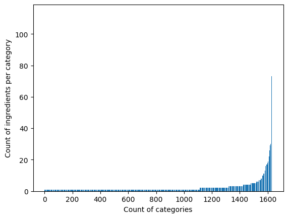
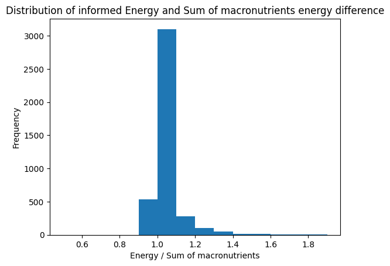

# Meal planner 
This is a "meal_plan" application that plans meals for you using a meal dataset from [Fineli](https://fineli.fi/fineli/en/elintarvikkeet/resultset.csv)

Demo: https://meal.riko.io/

## Run locally as a website
After you have [Docker](https://www.docker.com/get-started) on your local machine, clone the repo and run the following command in the folder:
```
$ make run
```
After this the Meal Planner UI is served in your local port http://0.0.0.0:5000/ and http://0.0.0.0:5000/meal-plan.

## Run on a server as a website
Instructions on how to setup https and Nginx-proxy for this website:
[Host multiple websites with HTTPS on a single server](https://medium.com/@francoisromain/host-multiple-websites-with-https-inside-docker-containers-on-a-single-server-18467484ab95)

First, you have to create an Nginx-proxy to your server for controlling the traffic ([simple instruction here](https://medium.com/@francoisromain/host-multiple-websites-with-https-inside-docker-containers-on-a-single-server-18467484ab95)). After you have gone through the instructions and updated `docker-compose.yml`, you can just download this repo to your server and run the following command in the folder.
```
$ make server
```

Then just enjoy you meals :D

Ps. If it does not work right away, it might take a few minutes to get the https certificate.


## Run tests
```
python -m unittest
```


# Details about the Meal Plan application

## Requirements:
1. Total calories per day should be as close to 2000 kcal as possible. 
- The system is capable to produce exact number but due to roundings and unclear energy calculations (see Details section 7.) these are not always exactly 2000 kcal.
2. Energy division by macronutrients, as accurately as possible:
- 50 % of energy should be from carbs - Done
- 30 % from proteins - Done
- 20 % from fat - Done
3. At least 20 g of fiber per day
- Due to rounding error, this might sometimes be under 20g and hence, the requirement is currently 25g in the algorithm.
4. At most 500 g of a single food item per day
- This limitation has no problems
5. No items from the same food group (e.g. “cake” or “cheese”) on successive days 
- If only looking at the successive days, the algorithm would only suggest two different meals every other day. Hence, to improve this requirement I have added categories (see Details section 3.) and expanded the restrictions of previous meals (see Details section 4.).
6. At least 3 different food groups need to be chosen for every day
- This constraint is satisfied naturally throughout all the other constraints
 
7. Sufficient tests for loading the data from the url & seeing it fits the schema. Elegantly handle such a situation where these fail.
- All the input data is run through a schema every time it is used in the algorithm. If there are any problems in the data, the system will inform what are the problems. Data import tests can be also ran with `python -m unittest`.

## Details
### 1. Alcohol
Food that has over 0.4g/100g of alcohol will be removed (including tiramisu that includes rum).

### 2. Salt and sodium
If the amount of salt/sodium is not limited, the algorithm may suggest way too much salt and sodium. Hence, I will add an option to limit salt.

### 3. Improved food categories
The categories in the dataset seem to work as following:
```
Food_1: "Hamburger, Chicken Burger, Mcdonald'S" --> category "Hamburger"
Food_2: "Yoghurt, Flavoured, 7% Fat" --> category "Yoghurt"
```
So it seems that the first section if the category (when divided by comma) and the following sections are some extra info.

To improve the recommendations, on top of the current constraints, I will list some common food ingredients to an "extra_categoty". This is to make sure that there is enough variation in the food so that it is healthier and more appealing. 
> These "extra_categoty" ingredients are: __chicken, pork, beef, ham, kebab, fish, cheese, shrimp, porridge, hamburger, pasta, salmon, cake, lamb, tofu.__

Constraint of this improvement is that one meal can get only 1 extra category. E.g. "Chicken Hamburger, Mcdonald'S" get chicken an not hamburger because it is first in the list.

<details>
<summary>Count of these ingredient in categories (first section) and foods (the whole food name)</summary>

Ingredient | Category count this occurs | Food count this occurs |
----------|----|-----|
chicken   | 80 | 125 |
beef      | 78 | 142 |
pork      | 54 | 106 |
cheese    | 44 | 108 |
cake      | 38 | 118 |
fish      | 37 | 83  |
porridge  | 33 | 81  |
ham       | 26 | 40  |
pasta     | 22 | 47  |
shrimp    | 14 | 15  |
salmon    | 19 | 34  |
hamburger | 10 | 39  |
lamb      | 10 | 16  |
tofu      | 9  | 11  |
kebab     | 6  | 7   |

</details>

However, these categories could be improved even more but that is something to do in future implementations.

<details>
<summary>Distribution for ingredient count per category</summary>



</details>

### 4. Previous meals
To improve your meal plans I have added a constraint so that the system will not recommend similar meal plans that you have had in the same week. This is done by locking used meals and releasing them evenly during a long period of time in random order.

Without these improved constraints, the meal planner will suggest two different meals every other day.

### 5. Allergies
Now I have added one optional allergy constraint which gives you a possibility to rule out any food that has Lactose.

### 6. Improving the meal plans with better data
In future these meal plans could be improved by going throught that Fineli data and cleaning. Also trying to find more relevant food/meal databanks could improve the quality and variety of these meal plans.

### 7. The actula amount of energy of every meal
The amount of energy (kcal or kJ) from a 1 gram of macronutrient is generally calculated as follows:
- 1g of carbs = 4 kcal (17 kJ)
- 1g of protein = 4 kcal (17 kJ)
- 1g of alcohol = 7 kcal (30 kJ) 
- 1g of fat = 9 kcal (38 kJ)

When calculating the energy sum of macronutrients of each food item in the [Fineli](https://fineli.fi/fineli/en/elintarvikkeet/resultset.csv) dataset, most of them are close to the informer `energy,calculated (kJ)`. To be exact 96.8% of the informed energy was within -10% to +30% of the calculated energy sum of macronutrients. 

However, there are some products that are extreme outliers. This might be caused by some ingredients that are not listed in macronutrient but are added to the `energy,calculated (kJ)`. For example **fibre, xylitol, and sorbitol** are not included in either sugar or carbs even though it clearly exists in the product energy calculated (kJ).

This makes sense to some level because fibre does not really contribute calories to the body, in a roundabout way ([source](https://www.ncbi.nlm.nih.gov/pubmed/30805214)).  On the other hand, Sorbitol and Xylitol include calories, about 2.5 calories per gram, but that is significantly less than normal sugar which is about 4 calories per gram, but they don't seem to be calculated as sugar at all. See the problem cases under here:

Row |                           name  |energy,calculated (kJ) | fat, total (g) | carbohydrate, available (g) | protein, total (g) | fibre, total (g) | sugars, total (g) | alcohol (g)|
----|---------------------------------|-----------------------|----------------|-----------------------------|--------------------|------------------|-------------------|------------|
2369|Oat, Coarse-Ground Oat, Kaurakuitunen |             1075 |            3.3 |                        16.1 |                7.2 |             69.7 |               0.6 |           0|
2542|Pastille Sweetened With Xylitol  |                  1000 |            0.8 |                           0 |                0.5 |                0 |                 0 |           0|
3472|Sorbitol                         |                  1000 |              0 |                           0 |                  0 |                0 |                 0 |           0|

<details>
<summary>Most significant outliers</summary>

Row  |                                               name | energy,calculated (kJ) | fat, total (g) | carbohydrate, available (g) | protein, total (g) | fibre, total (g) | sugars, total (g) | alcohol (g) | energy / sum of macronutrients |
-----|----------------------------------------------------|------------------------|----------------|-----------------------------|--------------------|------------------|-------------------|-------------|-------------|
3074 |               Rowanberry, Dried, Rowanberry Powder |                   1103 |            6.9 |                         8.2 |                8.8 |             50.3 |               7.5 |           0 |  2.001089   |
2369 |              Oat, Coarse-Ground Oat, Kaurakuitunen |                   1075 |            3.3 |                        16.1 |                7.2 |             69.7 |               0.6 |           0 |  2.061361   |
3382 |                             Seaweed, Wakame, Dried |                    696 |            2.0 |                           0 |               14.4 |             47.1 |                 0 |           0 |  2.169576   |
941  |               Chokeberry, Dried, Chokeberry Powder |                   1013 |            2.4 |                        16.3 |                5.1 |             49.1 |              14.9 |           0 |  2.226374   |
2502 |                                            Parsley |                    114 |            0.2 |                         1.1 |                1.4 |              8.0 |               0.8 |           0 |  2.275449   |
3075 |                                 Rowanberry, Sorbus |                    313 |            1.2 |                         4.2 |                1.1 |              6.5 |               4.1 |           0 |  2.306559   |
972  |                             Coffee, Instant, Drink |                      4 |           <0.1 |                        <0.1 |                0.1 |                0 |                 0 |           0 |  2.352941   |
1736 |                                Lemon, Without Skin |                    138 |            0.2 |                         2.2 |                0.6 |              2.8 |               2.2 |           0 |  2.500000   |
1614 |                                Jerusalem Artichoke |                    218 |            0.1 |                         2.9 |                1.8 |             16.4 |               2.8 |           0 |  2.604540   |
1737 |                                   Lemon, With Skin |                     90 |            0.1 |                         1.4 |                0.4 |              1.8 |               1.4 |           0 |  2.616279   |
1739 |                Lemon Juice, Unsweetened, Undiluted |                     91 |              0 |                         1.6 |                0.3 |              0.1 |               1.6 |           0 |  2.817337   |
2543 |   Pastille Sweetened With Xylitol, Added Vitamin C |                    974 |            0.8 |                         8.0 |                1.1 |                0 |               8.0 |           0 |  5.262021   |
3939 |                              Vinegar, Wine Vinegar |                     86 |              0 |                         0.5 |                  0 |                0 |               0.5 |           0 | 10.117647   |
2791 |                                     Psyllium Husks |                    728 |            0.6 |                           0 |                1.5 |             85.0 |                 0 |           0 | 15.072464   |
3938 |                                            Vinegar |                    138 |              0 |                         0.5 |                  0 |                0 |               0.5 |           0 | 16.235294   |
1406 |                             Full- Xylitol Pastille |                    937 |            0.8 |                           0 |                0.5 |                0 |                 0 |           0 | 24.087404   |
2542 |                    Pastille Sweetened With Xylitol |                   1000 |            0.8 |                           0 |                0.5 |                0 |                 0 |           0 | 25.706941   |
3300 |              Salty Liqourice Pastille, Unsweetened |                    799 |            0.2 |                           0 |                0.1 |              NaN |                 0 |           0 | 85.913978   |
1275 |  Fitness Drink With Added Vitamins, Artificiall... |                      4 |              0 |                           0 |                  0 |              0.5 |                 0 |           0 | inf         |
3662 |                           Sweet, Candy, Sugar-Free |                    812 |              0 |                           0 |                  0 |             34.0 |                 0 |           0 | inf         |
3733 |                                                Tea |                      1 |              0 |                           0 |                0.1 |                0 |                 0 |           0 | inf         |
3734 |                                     Tea, Green Tea |                      1 |              0 |                           0 |                0.1 |                0 |                 0 |           0 | inf         |
3472 |                                           Sorbitol |                   1000 |              0 |                           0 |                  0 |                0 |                 0 |           0 | inf         |
782  |                     Chewing Gum, Xylitol Sweetened |                    773 |              0 |                           0 |                  0 |              2.4 |                 0 |           0 | inf         |
76   |                   Baking Soda, Bicarbonate Of Soda |                      0 |              0 |                           0 |                  0 |                0 |                 0 |           0 | NaN         |
1184 |                                         Erythritol |                      0 |              0 |                           0 |                  0 |                0 |                 0 |           0 | NaN         |
1631 |    Juice Drink, Sugar-Free, Artificially Sweetened |                      0 |              0 |                           0 |                  0 |                0 |                 0 |           0 | NaN         |
2123 |                                      Mineral Water |                      0 |              0 |                           0 |                  0 |                0 |                 0 |           0 | NaN         |
2124 |                          Mineral Water, Low Sodium |                      0 |              0 |                           0 |                  0 |                0 |                 0 |           0 | NaN         |
2129 |    Mineral Water, Novelle Plus, With Added Calcium |                      0 |              0 |                           0 |                  0 |                0 |                 0 |           0 | NaN         |
2130 |  Mineral Water, Novelle Plus, With Added Vitami... |                      0 |              0 |                           0 |                  0 |                0 |                 0 |           0 | NaN         |
3293 |                    Salt, Rock Salt, Without Iodine |                      0 |              0 |                           0 |                  0 |                0 |                 0 |           0 | NaN         |
3379 |                            Seasalt, Without Iodine |                      0 |              0 |                           0 |                  0 |                0 |                 0 |           0 | NaN         |
3465 |                      Soft Drink, Light, Sugar-Free |                      0 |              0 |                           0 |                  0 |                0 |                 0 |           0 | NaN         |
3678 |                               Sweetener, Cyclamate |                      0 |              0 |                           0 |                  0 |                0 |                 0 |           0 | NaN         |
3680 |  Sweetener, Hermesetas Liquid, Saccharin And Cy... |                      0 |              0 |                           0 |                  0 |                0 |                 0 |           0 | NaN         |
3681 |                               Sweetener, Saccharin |                      0 |              0 |                           0 |                  0 |                0 |                 0 |           0 | NaN         |
3735 |                                    Tea, Herbal Tea |                      0 |              0 |                           0 |                  0 |                0 |                 0 |           0 | NaN         |
3953 |                                   Water, Tap Water |                      0 |              0 |                           0 |                  0 |                0 |                 0 |           0 | NaN         |

</details>
<details>
<summary>Outliers dirtribution</summary>



</details>